# HopelessDefence - Game Design Document

V tomto repozitári sa náchadza implementácia hry v **Pygame**.

Hra reprezentuje semestrálnu prácu z predmetu **Objektové Technológie** (**OT**).

**Autor:** Ivan Klopček

**Vybraná téma:** _One level, but constantly changing_ - jeden level, ale neustále sa mení.

---

## 1. Úvod

**HopelessDefence** je _tower defense_ hra vytvorená ako semestrálny projekt pre predmet Objektové Technológie. Hra spĺňa zadanú tému "_One level, but constantly changing_", kde hráč musí brániť svoju **základňu** proti neustále sa meniacim vlnám **nepriateľov**. 

Hlavným cieľom hry je **prežiť** čo najdlhšie pomocou **strategického** umiestňovania **veží** a efektívneho manažovania **zdrojov**. Hráč musí čeliť rôznym typom nepriateľov, ktorí sa postupne stávajú **silnejšími** a **nebezpečnejšími**. Každá hra je _jedinečná_ vďaka **dynamickému systému vĺn** nepriateľov a možnostiam **vylepšovania veží**.

### 1.1 Inšpirácia

> _**Bloons TD**_
>
> **Bloons TD** je _tower defense_ hra zameraná na **strategickú obranu** územia pomocou rôznych typov **veží**, ktoré chránia cestu pred prichádzajúcimi vlnami nepriateľov. Koncept hry je založený na **postupnom budovaní** obranného systému, kde hráč musí čeliť čoraz väčšiemu množstvu nepriateľov s rozličnými vlastnosťami a schopnosťami. Hra ponúka **komplexný systém vylepšovania** veží, kde každá veža má svoj _unikátny strom vylepšení_ a _špeciálne schopnosti_.

<p align="center">
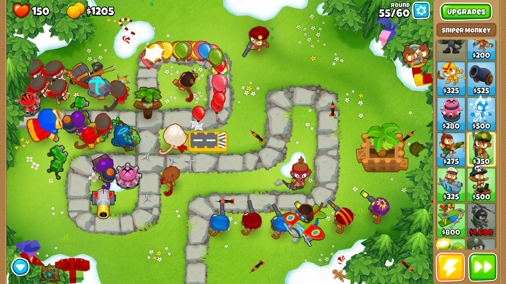
<br>
<em>Obrázok 1 - Ukážka hry Bloons TD</em>
</p>

### 1.2 Herný zážitok

Cieľom hry je, aby hráč **ubránil** svoju základňu pred neustále prichádzajúcimi vlnami nepriateľov. Hráč musí **strategicky** umiestňovať obranné veže po mape a **efektívne** ich vylepšovať, aby dokázal čeliť čoraz silnejším nepriateľom. Každá veža má svoje _jedinečné vlastnosti_ a _schopnosti_, ktoré môžu byť kľúčové pre prežitie.

Hra sa odohráva na jednej **dynamicky sa meniacej mape**, kde sa nepretržite zvyšuje **náročnosť** a počet nepriateľov. Hráč musí správne **hospodáriť** so získanými zdrojmi, ktoré dostáva za eliminovanie nepriateľov, a využívať ich na **stavbu** nových veží alebo **vylepšovanie** existujúcich. Prežitie každej ďalšej vlny vyžaduje _premyslenú stratégiu_ a _rýchle rozhodovanie_.

### 1.3 Vývojový softvér

| Nástroj | Použitie |
|---------|----------|
| **Pygame-CE** | Zvolený programovací jazyk |
| **Visual Studio Code** | Vybrané IDE |
| **Joystix** (1001fonts.com) | Herný font |
| **ElevenLabs** | Nástroj na generovanie zvukových efektov |
| **PixelLab.ai** | Tvorba pixel art grafiky |
| **Suno.ai** | Generovanie hernej hudby |

---

## 2. Koncept

### 2.1 Prehľad hry

**HopelessDefence** je _tower defense_ hra postavená na princípe **dynamicky sa meniacej mapy**. Hráč v role obrancu základne musí čeliť neustálym vlnám nepriateľov prostredníctvom **strategického** umiestňovania a vylepšovania obranných veží. S každou vlnou sa mapa mení, čím vytvára **unikátne výzvy** a núti hráča **adaptovať** svoju stratégiu. Hlavným cieľom je **prežiť** čo najdlhšie a dosiahnuť čo najvyššie skóre pomocou efektívneho využívania dostupných zdrojov a taktického rozmiestnenia obrany.

### 2.2 Interpretácia témy

"_One level, but constantly changing_" reprezentuje základný princíp hry, ktorý sa prejavuje v **štyroch kľúčových aspektoch**:

> - **Dynamická mapa**: Každá vlna prináša nový layout s unikátnymi trasami a strategickými pozíciami pre veže
> - **Progresívna náročnosť**: HP nepriateľov sa zvyšuje o 25% každou vlnou, vrcholiac súbojom s bossom
> - **Adaptívna ekonómia**: Znižujúci sa príjem mincí núti k strategickému hospodáreniu so zdrojmi
> - **Evolučný systém veží**: Dočasné vylepšenia veží počas hry

### 2.3 Základné mechaniky

#### **1. Systém mapy**
```
• Mapa obsahuje pevne stanovené cesty pre pohyb nepriateľov
• Špeciálne pozície (gold spots) poskytujú bonusy pre veže
• Každá mapa má definovaný štartovací a cieľový bod pre nepriateľov
```

#### **2. Systém nepriateľov**
```
• 4 typy nepriateľov s unikátnymi vlastnosťami:
  - Základný orb: Vyvážené vlastnosti
  - Rýchly orb: Zvýšená rýchlosť pohybu
  - Odolný orb: Zvýšené HP
  - Boss: Najsilnejší nepriateľ s vysokým HP
• Nepriatelia sa generujú na pevne stanovenom mieste
• Pohyb po preddefinovaných trasách
```

#### **3. Systém veží**
```
• 4 typy veží s rôznymi schopnosťami:
  - Laser Tower: Rýchla a trvalá streľba
  - Cannon Tower: Plošné poškodenie
  - Basic Tower: Vyvážený útok
  - Boost Tower: Podporné vylepšenia
• Každá veža má 2 unikátne vylepšenia
• Veže môžu byť predané alebo vylepšené počas hry
• Automatický predaj po skončení levelu
```

#### **4. Systém vĺn**
```
• Každá vlna obsahuje 15 nepriateľov
• Progresívna náročnosť:
  - Vlna 1: Len základné orby
  - Vlna 2: Základné a rýchle orby
  - Vlna 3: Všetky typy okrem bossa
  - Vlna 4: Všetky typy + boss na konci
• HP nepriateľov sa zvyšuje o 25% každou vlnou
• Po každej vlne sa náhodne vyberie nová mapa
• Vlna končí až po eliminácii všetkých nepriateľov
```

#### **5. Ekonomický systém**
```
• Základné zdroje:
  - Mince: Získané za eliminovanie nepriateľov
  - Životy: Strata pri preniknutí nepriateľa do základne
• Ceny veží:
  - Basic Tower: 100 mincí
  - Laser Tower: 150 mincí
  - Cannon Tower: 200 mincí
  - Boost Tower: 175 mincí
• Vylepšenia: 50-150 mincí podľa typu
• Predaj veží: 75% pôvodnej ceny
```

### 2.4 Návrh tried

**Tower**
```
- Správa všetkých typov veží a ich vlastností
- Systém vylepšení a útokov
- Manažment projektilových útokov
- Interakcia s ekonomickým systémom
```

**Enemy**
```
- Implementácia rôznych typov nepriateľov
- Systém pohybu po mape
- Správa zdravia a odmien
- Interakcia s vežami a projektilmi
```

**Wave**
```
- Generovanie vĺn nepriateľov
- Správa náročnosti a HP multiplikátora
- Manažment boss vĺn
- Aktualizácia hernej mapy
```

**Map**
```
- Definícia herných máp
- Správa špeciálnych pozícií
- Systém ciest pre nepriateľov
- Aktualizácia mapy medzi vlnami
```

**Economy**
```
- Správa hernej meny
- Systém odmien
- Manažment nákupov a vylepšení
- Konverzia zdrojov na kredity
```

**Shop**
```
- Systém permanentných vylepšení
- Správa kreditov
- Manažment multiplierov pre veže
- Ukladanie postupu vylepšení
```

## 3. Grafika

### 3.1 Interpretácia témy

> Grafický štýl hry je navrhnutý tak, aby podporoval hlavnú tému "_One level, but constantly changing_". Minimalistický dizajn s jasnými farebnými odlíšeniami umožňuje hráčovi rýchlo sa orientovať v dynamicky sa meniacom prostredí. Nepriateľské orby svojimi farbami indikujú ich typ a nebezpečnosť, zatiaľ čo veže svojím dizajnom jasne komunikujú ich funkciu a dosah. Tento prístup zabezpečuje, že aj napriek neustálym zmenám v hernom prostredí zostáva hra prehľadná a čitateľná.

### 3.2 Dizajn

#### **1. Nepriateľské jednotky**
```
• Dizajn nepriateľov využíva orbové tvary v charakteristických farbách:
  - Základný orb: Červený - symbolizuje základnú hrozbu
  - Rýchly orb: Modrý - evokuje dynamiku a rýchlosť
  - Odolný orb: Tmavofialový - vyjadruje odolnosť a silu
  - Boss: Čierny - najnebezpečnejší nepriateľ s impozantným vzhľadom
```

<p align="center">
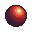

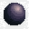
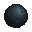
<br>
<em>Obrázok 2 - Typy nepriateľov (zľava: Základný, Rýchly, Odolný, Boss)</em>
</p>

#### **2. Obranné veže**
```
• Každý typ veže má unikátny vizuálny štýl:
  - Laser Tower: Futuristický dizajn s energetickými efektmi
  - Cannon Tower: Robustná konštrukcia s výrazným delom
  - Basic Tower: Klasický vzhľad s vyváženými proporciami
  - Boost Tower: Podporný dizajn s aura efektom
```

<p align="center">
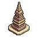
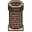
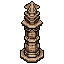
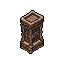
<br>
<em>Obrázok 3 - Typy veží (zľava: Laser, Cannon, Basic, Boost)</em>
</p>

#### **3. Efekty a projektily**
```
• Vizuálna spätná väzba pre rôzne herné mechaniky:
  - Laserové lúče s červeným efektom
  - Delové gule s explóziami
  - Štandardné projektily s tracer efektmi
  - Boost efekty zobrazujúce oblasť pôsobenia
```

#### **4. Herné prostredie**
```
• Prehľadný mapový dizajn:
  - Jasne viditeľné cesty pre nepriateľov
  - Zvýraznené špeciálne pozície (gold spots)
  - Kontrastné pozadie pre lepšiu čitateľnosť
```

<p align="center">
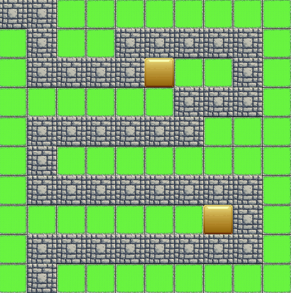
<br>
<em>Obrázok 4 - Ukážka herného prostredia</em>
</p>

#### **5. Dizajn menu**
```
• Grafické menu prvky vytvorené pomocou PixelLab.ai:
  - Hlavné menu s minimalistickým dizajnom
  - Herné menu s prehľadným zobrazením štatistík
  - Shop menu s intuitívnym rozložením
  - Game over obrazovka s jasnými možnosťami
```

<p align="center">
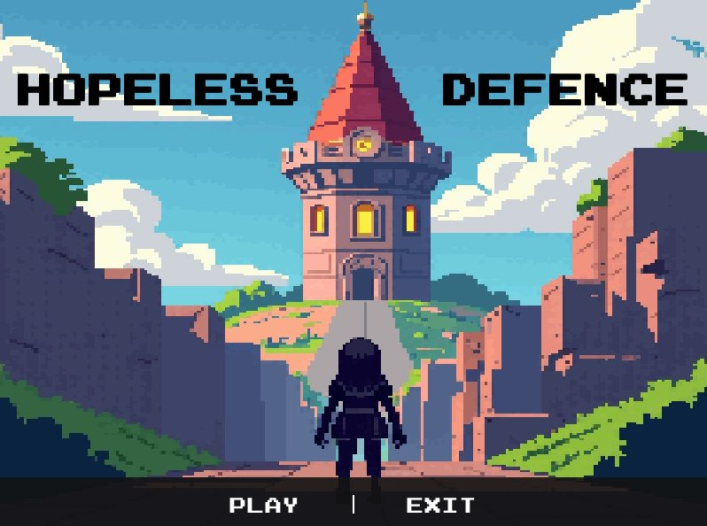
<br>
<em>Obrázok 5 - Hlavné menu</em>
</p>

<p align="center">
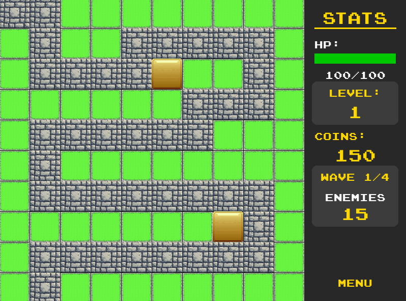
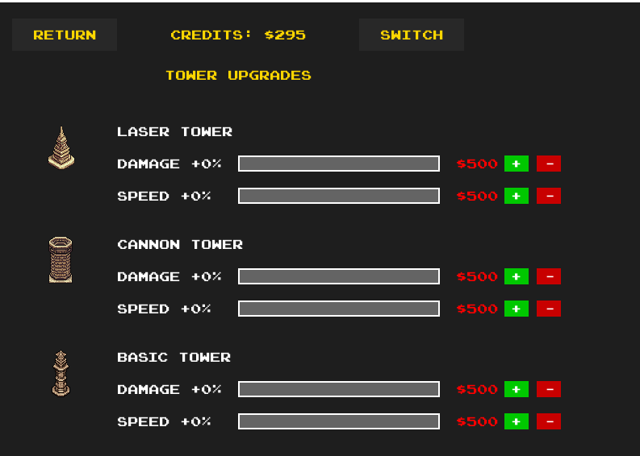
<br>
<em>Obrázok 6,7 - Herné menu (vľavo) a Shop menu (vpravo)</em>
</p>

<p align="center">
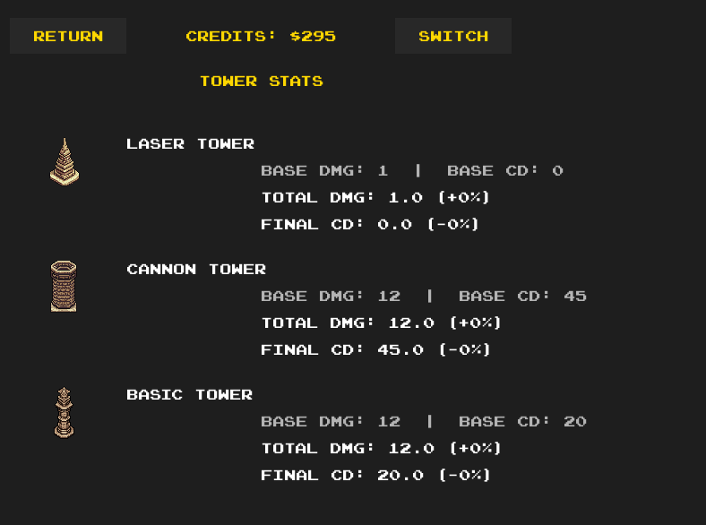
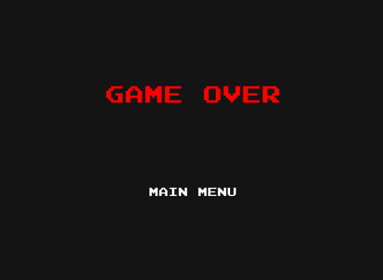
<br>
<em>Obrázok 8,9 - Detail shop menu (vľavo) a Game over obrazovka (vpravo)</em>
</p>

## 4. Zvuk

### 4.1 Hudba
```
• Hudobná stránka vytvorená pomocou Suno.ai:
  - Menu hudba: Príjemná ambientná melódia
  - Herná hudba: Dynamické melodické skladby
  - Shop hudba: Relaxačná atmosférická hudba
  - Victory/Game Over: Krátke tematické motívy
```

### 4.2 Zvukové efekty
```
• Zvukové efekty vytvorené pomocou ElevenLabs:
  - Veže a útoky:
    > Basic Tower: Tlmený výstrel
    > Laser Tower: Vysokofrekvenčný zvuk
    > Cannon Tower: Dunivý výstrel dela

```

## 5. Herný zážitok

### 5.1 Používateľské rozhranie
```
• Hlavná obrazovka:
  - PLAY: Spustenie novej hry
  - EXIT: Ukončenie hry

• Herná obrazovka:
  - Aktuálny level
  - Indikátor životov
  - Dostupné mince
  - Info o vlne
  - Počet nepriateľov
  - MENU tlačidlo

• Kontextové menu:
  - Výber typu veže
  - Menu vylepšení
  - Cenník a vlastnosti
```

### 5.2 Ovládanie
```
• Myš:
  - Ľavé tlačidlo:
    > Výber pozície veže
    > Potvrdenie výberu
    > Nákup vylepšení
  - Pravé tlačidlo:
    > Zrušenie výberu
    > Zatvorenie menu
    > Predaj veže

• Interakcia s vežami:
  - Klik na vežu: Menu vylepšení
  - Klik na pole: Stavba veže
  - Predaj: Pravý klik + potvrdenie

• Obchod:
  - Výber myšou
  - +/- pre nákup
  - SWITCH: Zmena kategórie
  - BACK: Návrat do hry

• Boss obrazovka:
  - CONTINUE: Ďalšia vlna
  - SHOP: Nákup vylepšení
  - MENU: Hlavné menu
```


